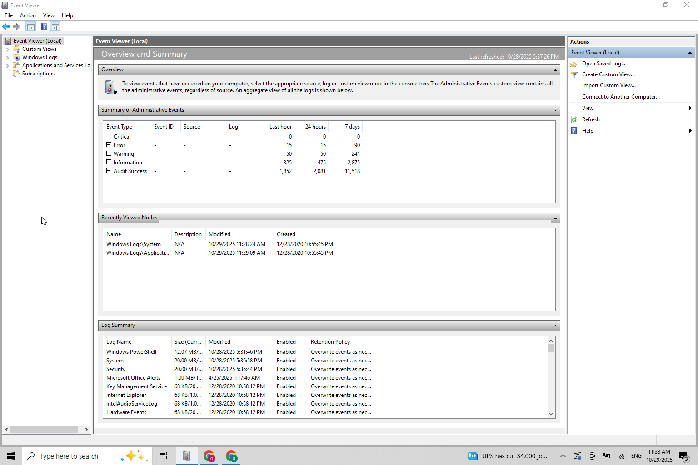

# 🧩 Windows Event Viewer Lab

**Goal:** Practice a clear workflow for reading Windows Event Viewer logs and isolating issues (updates, app crashes, security events).  
All screenshots are from a live system and mirror real troubleshooting steps I’ve done in practice.

---

## 📋 Plan (what this lab covers)
1. Open Event Viewer & identify core log buckets.  
2. Review **System** log for update/client errors.  
3. Review **Security** log (baseline audit activity).  
4. Use **Filter Current Log…** to hunt failures in Security.  
5. Review **Application** log and analyze a real app crash (Cisco Packet Tracer).

---

## 1) Event Viewer — Main Overview
Where we start: the navigation tree for **Windows Logs → Application / Security / Setup / System**.  
Knowing where each class of events lives lets you jump to the right place quickly after a failure.

---

## 2) System Log — Update / Client Error Example
Navigate: **Windows Logs → System**.  
Here I highlight an **Error** from Windows Update (source `WindowsUpdateClient`) as a typical OS-level failure.  
From the lower pane you get the **Event ID**, **Source**, and a human-readable **Description** you can action (retry/update, repair components, check network/proxy, or defer).

---

## 3) Security Log — Baseline Audit Activity
Navigate: **Windows Logs → Security**.  
You’ll often see many **Audit Success** events (logons, token use, group enumeration). This is healthy baseline activity.

**Why baseline matters:** before chasing “problems,” understand what *normal* looks like on the host.

---

## 4) Security Log — Use “Filter Current Log…”
Action: **Security → Filter Current Log…** then select **Error** and **Warning** (and optionally a time window).  
In this capture, there were no matching failure entries in the interval—this is still useful because it lets you **de-scope Security** and focus elsewhere.

---

## 5) Application Log — Packet Tracer Crash (Real Example)
Navigate: **Windows Logs → Application** to review app-level issues.  
First, an overview of the Application log context:

Then, a real crash example: **Application Error (Event ID 1000)** for **Cisco Packet Tracer 9.0.0**.  
The faulting module is `Qt6Core.dll` (Qt framework dependency), which commonly points to missing libraries, version mismatches, or incomplete installs.

**How I’d proceed in practice:**
- Confirm version & install path in the **General** pane.  
- Check **Details** (XML) for fault offset/hash.  
- Correlate timestamps with **System** entries (driver/update changes, AV blocks).  
- Reinstall/repair the app or required runtimes (Qt/VC++).  
- Note: I’ve seen similar patterns while deploying Ekran System on Windows VMs—root cause was missing dependencies or incomplete installation.

---

## ✅ Takeaways
- Use the **right log** for the right problem:  
  - **System** = OS & updates, drivers, hardware  
  - **Security** = auth/audit  
  - **Application** = app crashes & errors  
- **Filter** by severity/time to cut noise and isolate root causes fast.  
- Read **General** first (plain-English summary), then **Details/XML** for precise fields (IDs, modules) you can search by.

---

## 📂 Repo Structure
windows_event_viewer_lab/
├─ images/
│ ├─ event_viewer_main_overview.png
│ ├─ event_viewer_application_overview.png
│ ├─ event_viewer_system_error_details.png
│ ├─ event_viewer_security_log_overview.png
│ ├─ event_viewer_security_failure_filter_empty.png
│ └─ event_viewer_application_log_error.png
└─ README.md
